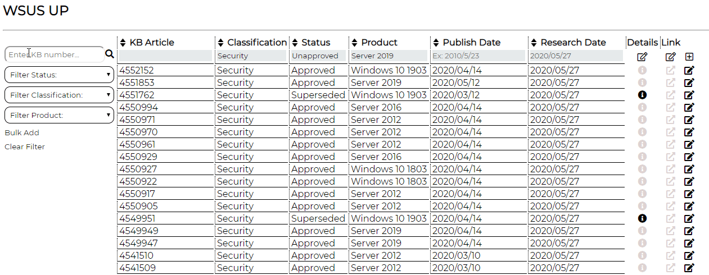
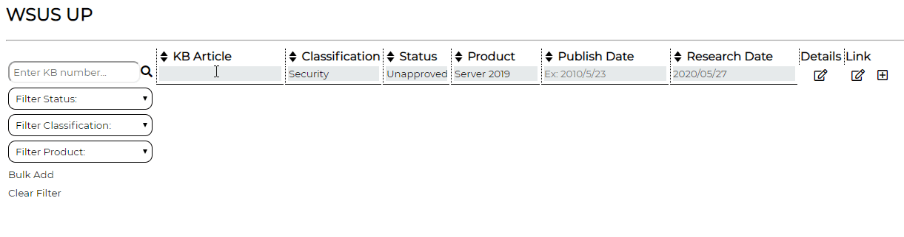
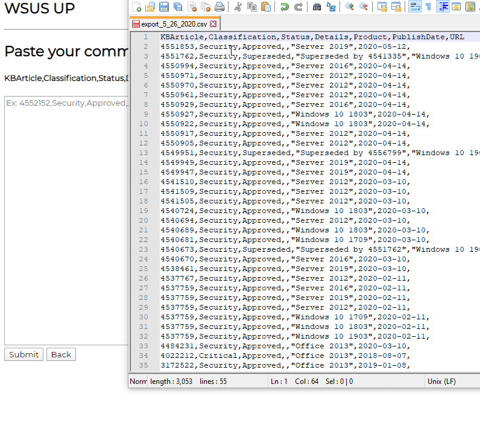

# WSUS_UP

Node / MySql / jQuery app to track Windows Server updates for my job.

Windows Server Update Service, or WSUS (pronounced "WUS"), is Microsoft's free solution for centralized management of updates on Windows operating systems.

# Description

Microsoft updates have long been a source of stress for sysadmins because of their tendency to break things. It's a common practice for administrators from smaller organizations to delay applying patches for a week or two. This allows enough time for researchers and tech journalists to discover and report on any trouble with that month's crop of updates. We don't have a lot of resources for testing at my work so take the "wait and research" approach.

When there is a "bad" patch Microsoft usually fixes it in subsequent weeks or months. Sometimes the updated patches have new bugs, and sometimes they update a patch with the same bug for several months in a row. Keeping track of all of this takes a lot of time and effort. Each update requires several minutes to research and evaluate. I was tracking them all in an Excel spreadsheet but this quickly became unmanageable. Once the spreadsheet reached a couple hundred rows it was painful to scroll up and down looking for updates I had already researched, and occassionally I would edit a cell as a on accident. I started working on this project to replace the spreadsheet.

Admittedly, this application doesn't do much that I wasn't also doing with my original Excel spreadsheet. My goal is to make it easier to use than Excel, and to store all the update information in a database where it would be safe from errant clicks accidentally inserting or deleting the wrong cell. I wanted something to create something that would outlast my time at the company.

# How To Install

Clone the repo

Run the seed script to populate your SQL database

Run `npm install` to install dependencies

# Add A Row

Run the app with `nodemon server.js`

Browse to `localhost:8080`

Use the input fields to enter update info

Click `Add` to add a new update to the database

# Bulk Add

Click the Bulk Add button

Paste in comma-separated values in the specified format

# To Do

Dynamic search functionality

Search failure message

Delete functionality

Highlight row on click

Input sanitization for editing and adding rows
